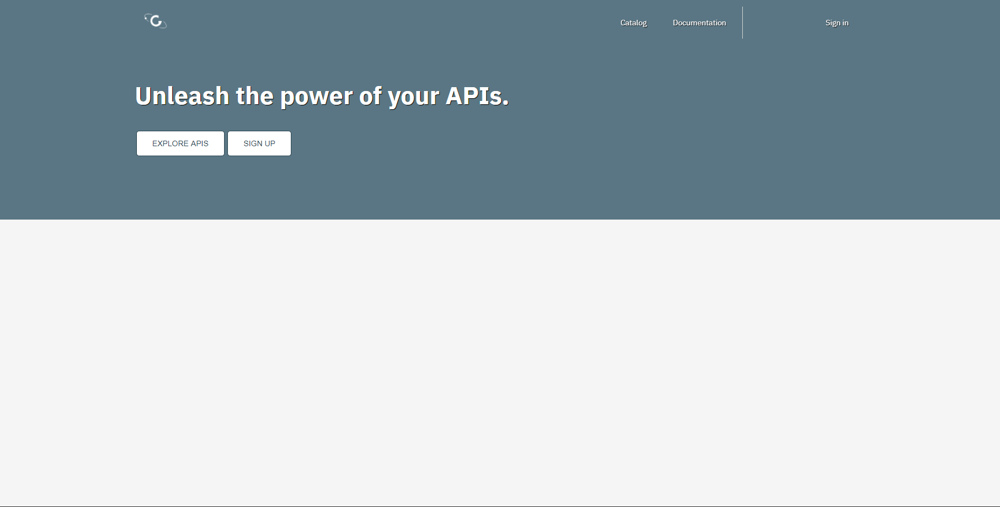
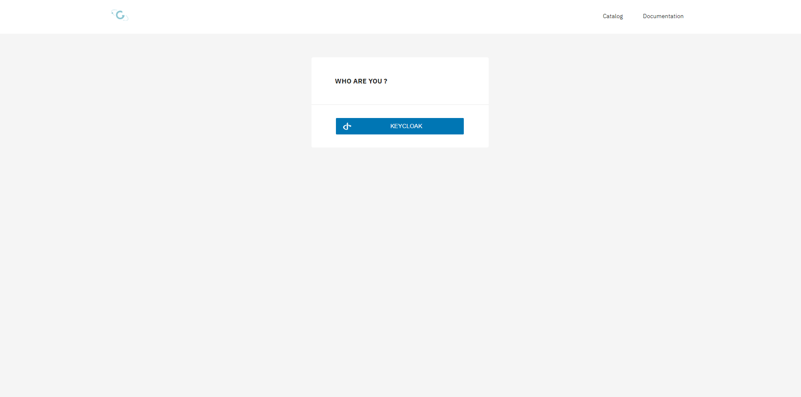
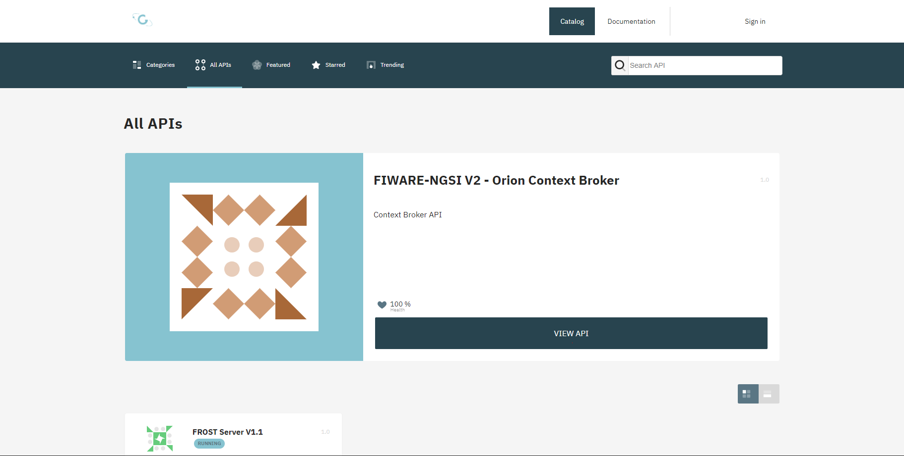
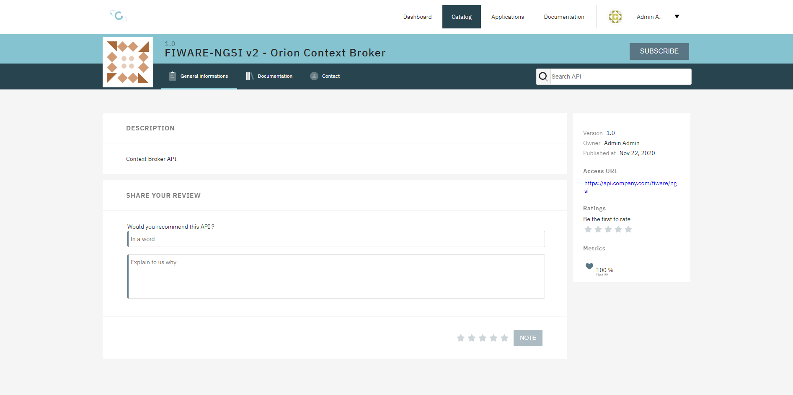
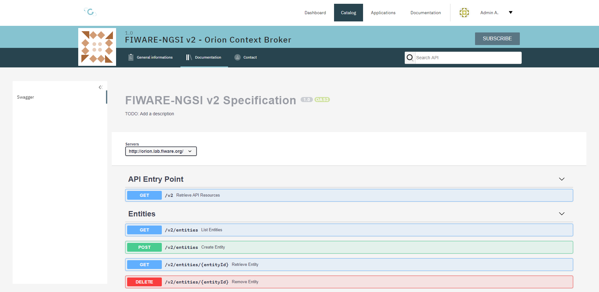
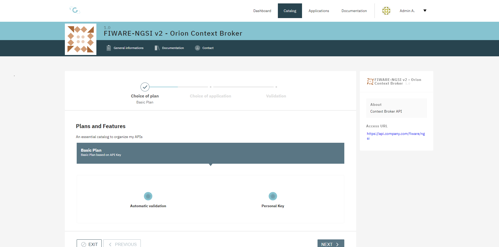
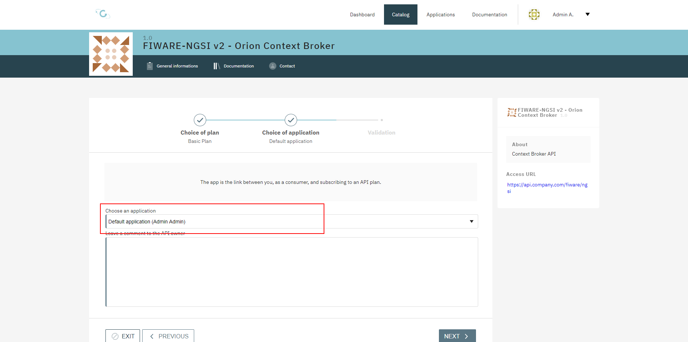
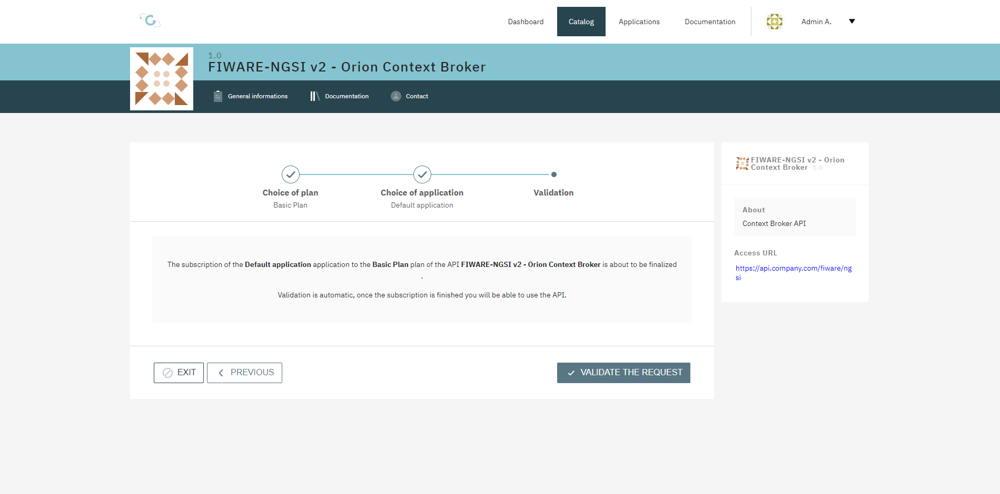
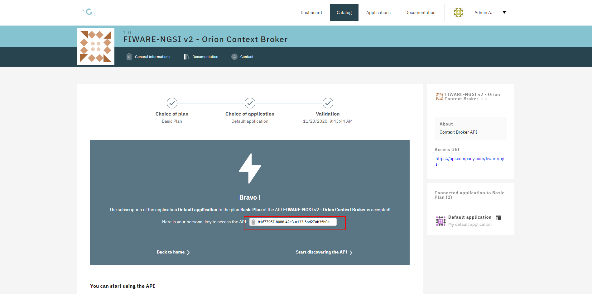

# Getting API Access for a registered User

In order to get an API Key for using a protected API, you need a registered user which was created in  [Step 1](getting_started/IDM_first_steps.md) of the getting started documentation.

The Platform uses [Gravitee](https://gravitee.io/) as the central API Management. After the first Deployment the API of the Orion Context Broker and the FROST Server (SensorsThingsAPI) are deployed.

You have to open [https://api.\<your.domain>/](https://api.\<your.domain>) to open the API Management Developer Portal.



If you are not logged in please sign in using the `Sign in`-Link. You will be asked to log in as shown in the next step.



Please hit the button `KEYCLOAK` to use the OAuth Login of Keycloak. How to use this is described in [this documentation](getting_started/IDM_first_steps.md)

After Signing-In you will be redirected to the following page.

A click on the Button `Explore APIs` and then selecting the Tab `All APIs` shows the current published APIs in the API Catalog.



Using the Button `VIEW API` leads you to the API Documentation Details. These are shown in the next two screenshot.





To get an API Key, please hit the Button `SUBSCRIBE` at the right top of the page.



If there is more then one subscription plan, you have to make a choice, which one should be used. After that. please click `NEXT` at the bottom of the page.



As a next step choose the Application to use and click `NEXT` again.



To finalize the Subscription check the presented values and click on `VALIDATE THE REQUEST`.

As a result, you get your API Key.



To start using the API you can test with:

> curl "https://apigw.<your.domain>/fiware/ngsi/version" -H "X-Gravitee-Api-Key:5b031fcc-0e5b-4635-ad77-4d9975347711"

This should return an answer like this:

```
curl "https://apigw.test1.urban-data.cloud/fiware/ngsi/version" -H "X-Gravitee-Api-Key:5b031fcc-0e5b-4635-ad77-4d9975347711"
{
  "orion" : {
    "version" : "2.5.0-next",
    "uptime" : "1 d, 20 h, 43 m, 53 s",
    "git_hash" : "bab5f664811cfd38de8c78506d86c8cd1d695a4a",
    "compile_time" : "Wed Nov 18 11:02:52 UTC 2020",
    "compiled_by" : "root",
    "compiled_in" : "550ecf59a904",
    "release_date" : "Wed Nov 18 11:02:52 UTC 2020",
    "doc" : "https://fiware-orion.rtfd.io/",
    "libversions": {
       "boost": "1_53",
       "libcurl": "libcurl/7.29.0 NSS/3.44 zlib/1.2.7 libidn/1.28 libssh2/1.8.0",
       "libmicrohttpd": "0.9.70",
       "openssl": "1.0.2k",
       "rapidjson": "1.1.0",
       "mongodriver": "legacy-1.1.2"
    }
  }
}
```

For a further Usage of Gravitee, please have a look in the original Documentation:

- [API Consumer Guide](https://docs.gravitee.io/apim/3.x/apim_consumerguide_portal.html)
- [API Publisher Guide](https://docs.gravitee.io/apim/3.x/apim_consumerguide_portal.html)
