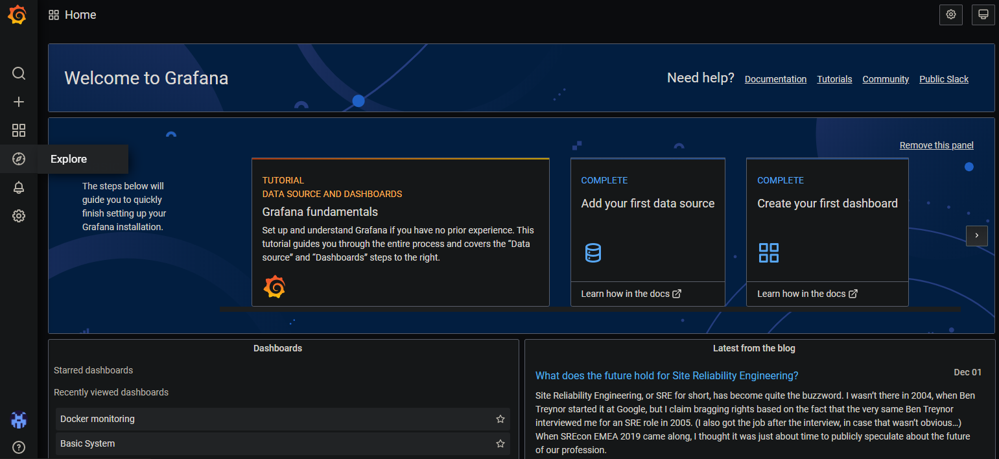
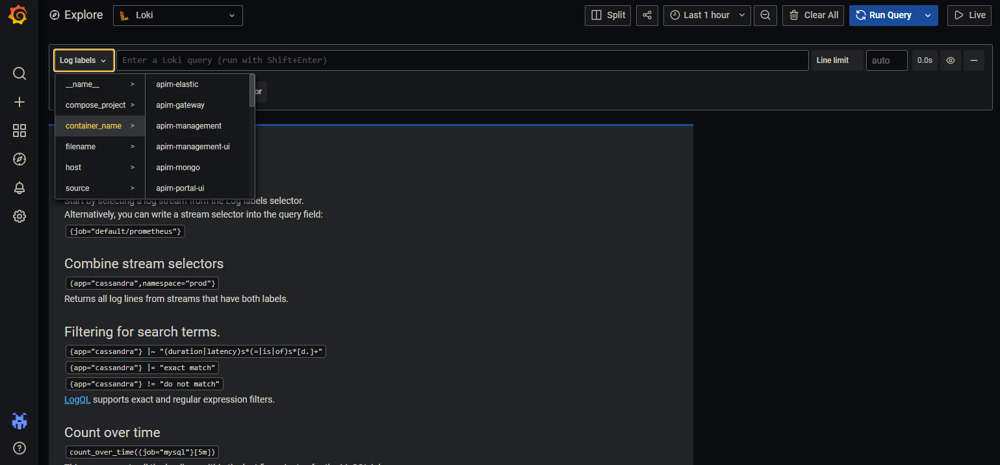

# Investigating Docker Container Logs

The platform includes a central logging for docker containers using `Grafana Loki`.
The container logs are send to the Monitoring Grafana instance at [https://monitoring.\<your.domain>/](https://monitoring.\<your.domain>).
The platform is configured to automatically send all containers' logs to Grafana, thus no extra configuration is required.

After Signing-In you will be redirected to the following page.

Open the `Explore` section on the left side menu to access the logs.
On the top, you cann access different logs via the `Log labels` drop down.

As an Example the following screnshot shows the logs of the external Node RED container.

For a further Usage of Grafana, please have a look in the original Documentation:

- [Datasource Management](https://grafana.com/docs/grafana/latest/datasources/)
- [Panel Management](https://grafana.com/docs/grafana/latest/)
- [Dashboard Management](https://grafana.com/docs/grafana/latest/dashboards/)
- [Grafana Loki](https://grafana.com/docs/loki/latest/)