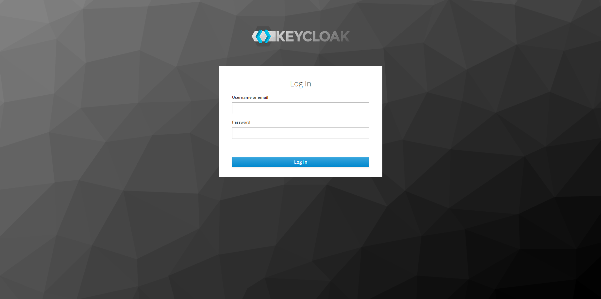
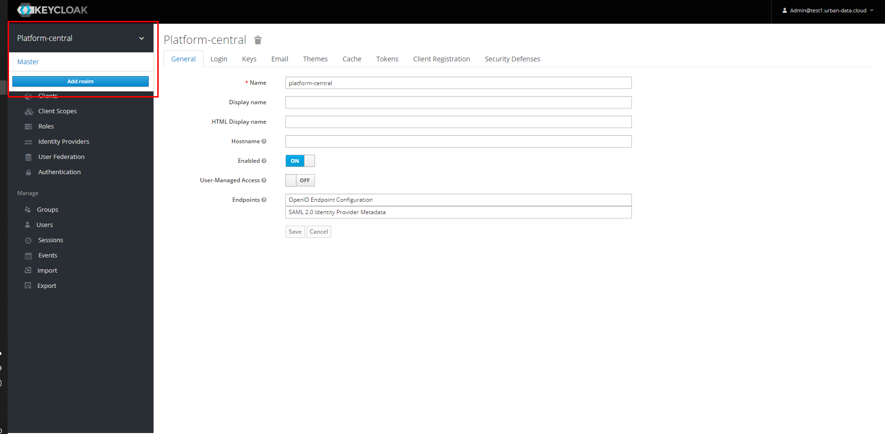
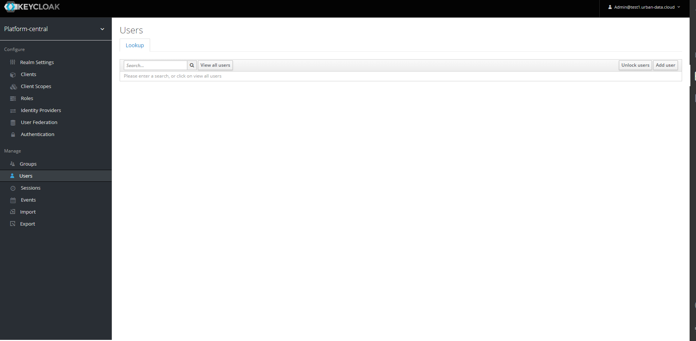
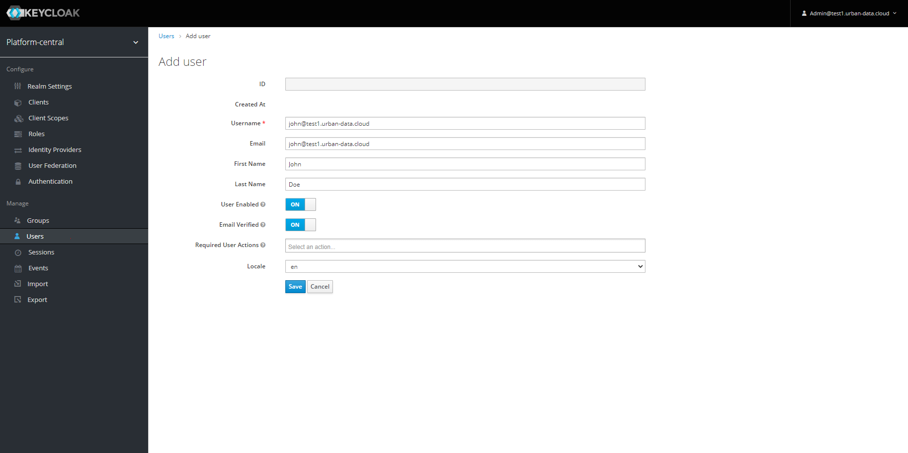
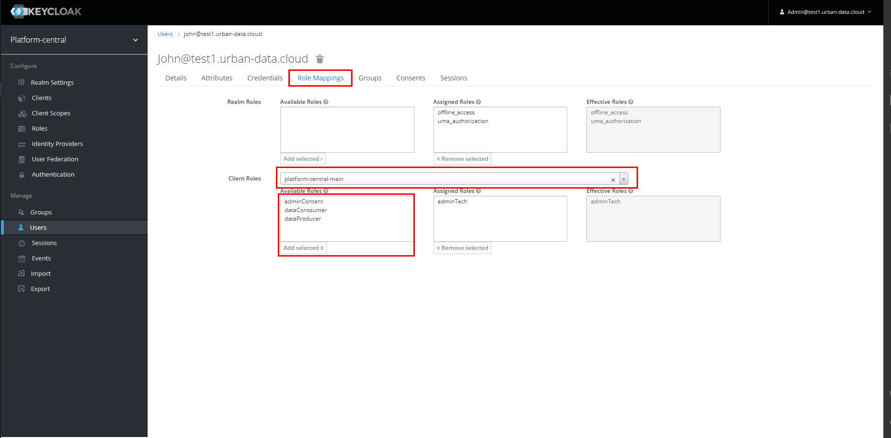
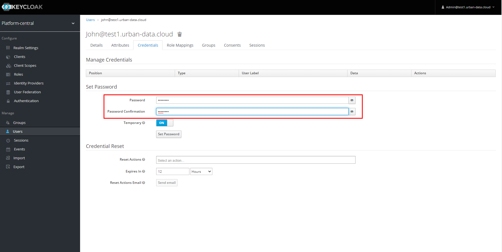

# Creating a new User in the central Identity Management

The Platform uses [Keycloak](https://www.keycloak.org/) as the central Identity Management.

You have to open [https://idm.\<your.domain>/](https://idm.\<your.domain>) and select Administration Console:

To Login use the user `admin@<your.domain>` and the Admin Password from the Inventory. Alternatively you have already create an additional Admin Account. In this case you can also use this.

After logging in, you will see the following Screen:

Please make sure, that you choose your Platform Realm here, to manage the platform settings (See the red marked area in the screenshot). The Realm called `master` is only used for managing Keycloak itself.

After Choosing the right Realm choose the User Area `Manage` - `Users`. You do not get any existing users in the result list by default, if you need to check another user, please add a search criteria or click on `View all users`.

To create a new user, click on the `Add user button` on the right side of the table. The following Screen asks for the basic User Settings.

Please make sure, that the fields `Username`, `Email`, `First Name`, `Last Name`, `User Enabled`, `Email Verified` and `Locale`  are filled as shown int the Screenshot.
When you have maintained all fields, hit `Save`.

After Saving the User the Result looks like the following Screenshot.

Next choose the Tab Role Mappings as shown in the following screenshot.

In the Down Down List `Client Roles` you have to choose the client, for which the roles should be configured. If nothing was changed after the basic deployment, the client is named `platform-central-main`.

After choosing the Client, the Listbox at the bottom are shown. Please choose the desired roles to assign. For now, only the role `adminTech` has Role Mappings in all other Components. After choosing the roles, hit the `Add selected` Button to assign the roles.

As a last step open the Tab `Credentials` as shown in the following screenshot.

On this tab you can set the (initial) Password for the user. Type in the password twice to confirm in the marked Fields and hit `Set Password` to set the Password. You have to confirm that you really want to set it in the upcoming dialog.

> If you want to allow the user to use the Password permanently, you can disable the Switch `Temporary`

For a further Usage of Keycloak, please have a look in the original Documentation:

- [User Management](https://www.keycloak.org/docs/latest/server_admin/index.html#user-management)
- [Role Management](https://www.keycloak.org/docs/latest/server_admin/index.html#roles)
