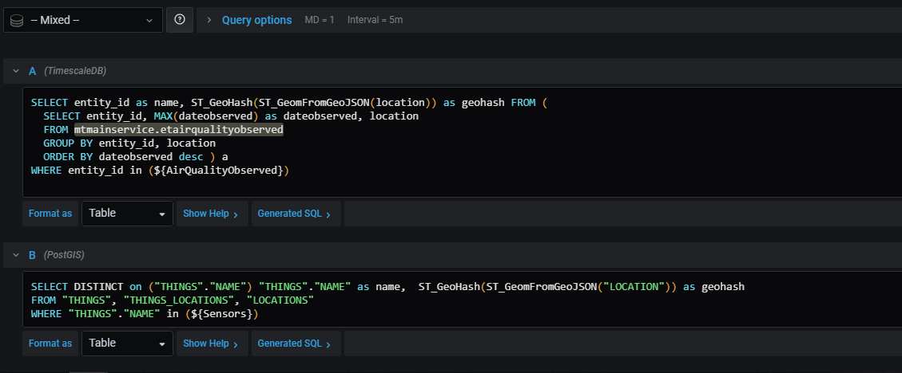
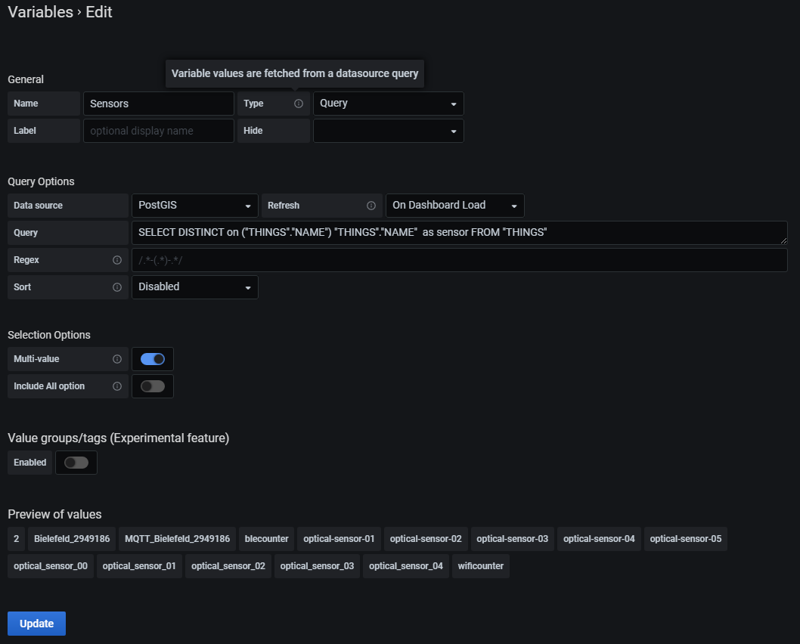
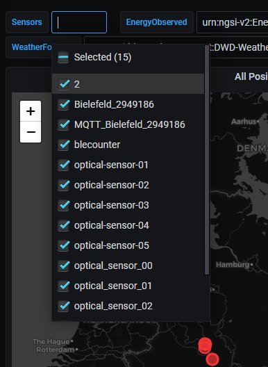
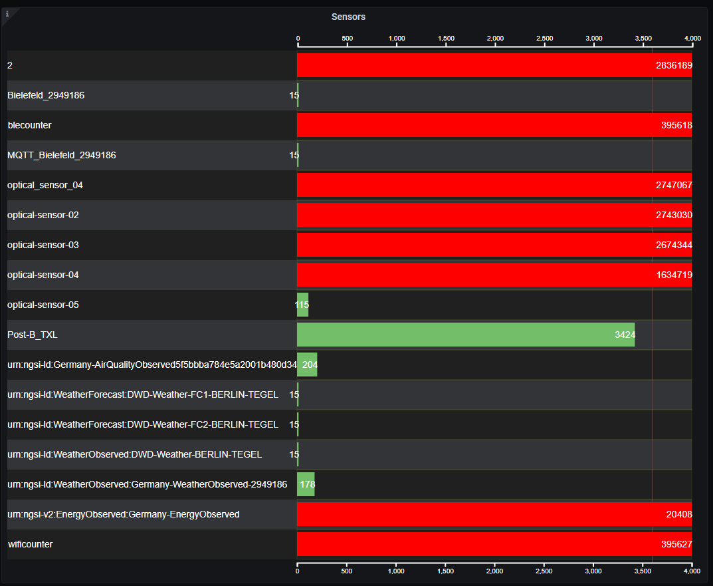
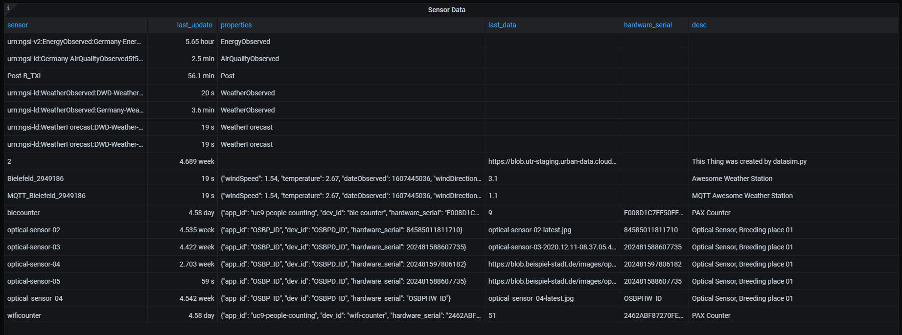

# Overview of Sensors using Grafana

The current implementation concept is based on mixed querys for data-retrieval and query variables for filtering.

The plugin [multistat-panel](https://grafana.com/grafana/plugins/michaeldmoore-multistat-panel) will be used to visualize the current state of the sensor.

## Gather all sensors
We are utilizing the timescale database for ngsi-data and postgres/-gis for sensorthings-data. 
Grafana offers the option to mix datasources and visualize all of the data in one dashboard panel.  
An example of the queries used to gather location data is shown in the next image:

In the first query all locations for the table _mtmainservice.etairqualityobserved_ (Air Quality Observed) are gathered from the timescale database. 
In the second query the same is done for locations stored in the postgres database. 
This query can easily be altered to gather data other than location data. 
(*Note:* The last line of each of these queries is used to filter the results and will described in the next section.)

## Filter sensors
Currently the sensors have no information stored of their context (usecase, purpose etc). Therefore the filtering is based on table and sensorname for now. 
There are not too much options for a user to interact with the dashboard. The refresh-interval is one and for time-series data there is the time range. 
For our filtering we will use variables that store data (changeable by the user) which can be used within the queries (like `${Sensors}` in queries shown before). 
An example for such a variable is shown in the next image:

After the variable is created, it is easy for the user to select sensors to be shown:

Additionally an interval-variable will be defined to show only sensors that have been active recently. This way it is possible to hide sensors which are stored in the database, but are not active anymore.

## Last sensor update
The following image shows an example configuration of the multistat panel. Addition options for grouping (if the data holds such information), different visualizations, and so on are possible and can be adjusted.

## Sensor metadata
The most convinient option is to use a table view for all sensors. This can be done by formulating queries for all tables, select all important metadata and merge the different results in one table to be visualized. 
As a side note there will be no error if one sensor for example has a hardware serial and another does not. This will result in an empty cell in the table. 
The following image will show an example of how the result could look like:

