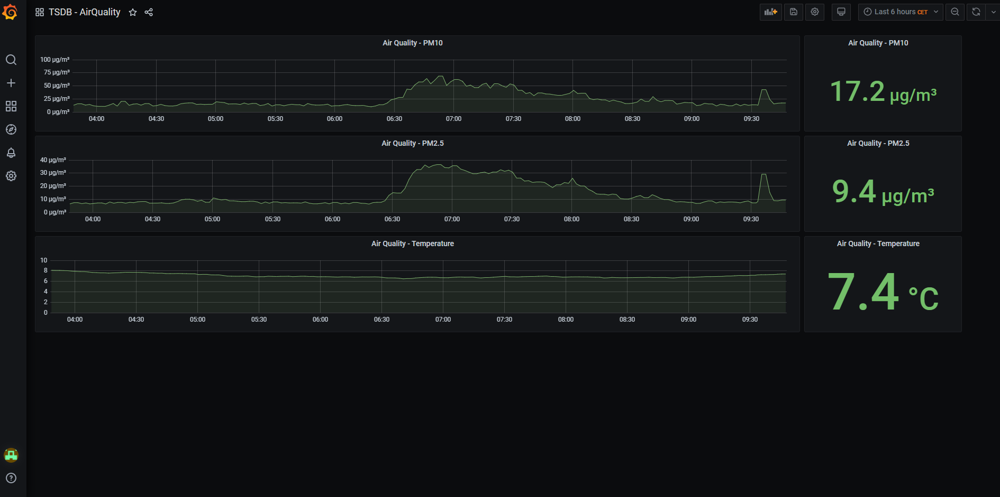

# Exploring data with interactive Grafana Dashboards

The Platform uses [Grafana](https://grafana.com/) as the central Dashboard Tool.

We have currently two Instances of Grafana deployed.
- Grafana for Data Management [https://grafana.\<your.domain>/](https://grafana.\<your.domain>)
- Grafana for Monitoring [https://monitoring.\<your.domain>/](https://monitoring.\<your.domain>)

Both Systems behave in the same way - so the following documentation is valid for both.

If you open Grafana and have no valid User Session, you will be asked to login.

Please hit the button `Sign in with OAuth` to use the OAuth Login of Keycloak. How to use this is described in [this documentation](getting_started/IDM_first_steps.md)

After Signing-In you will be redirected to the following page.

Garafa opens automatically the `Home` Dashboard. With a click on the `Home`-Link at the top you can choose between the already deployed Dashboards.

By choosing one of the listed Dashboards the respective Dashboard is opened.

As an Example the following Dashboard is shown.

For a further Usage of Grafana, please have a look in the original Documentation:

- [Datasource Management](https://grafana.com/docs/grafana/latest/datasources/)
- [Panel Management](https://grafana.com/docs/grafana/latest/)
- [Dashboard Management](https://grafana.com/docs/grafana/latest/dashboards/)
