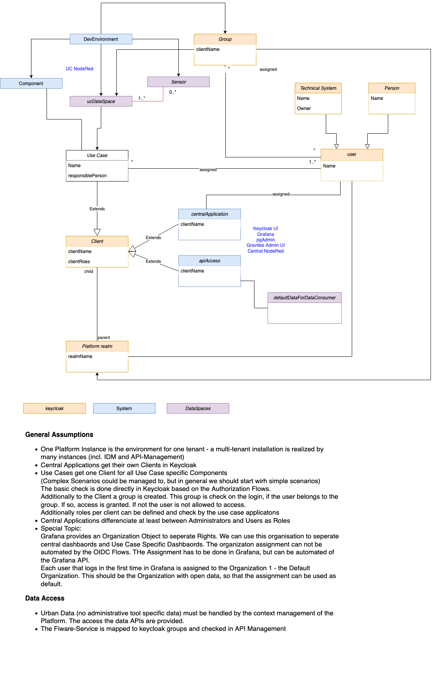
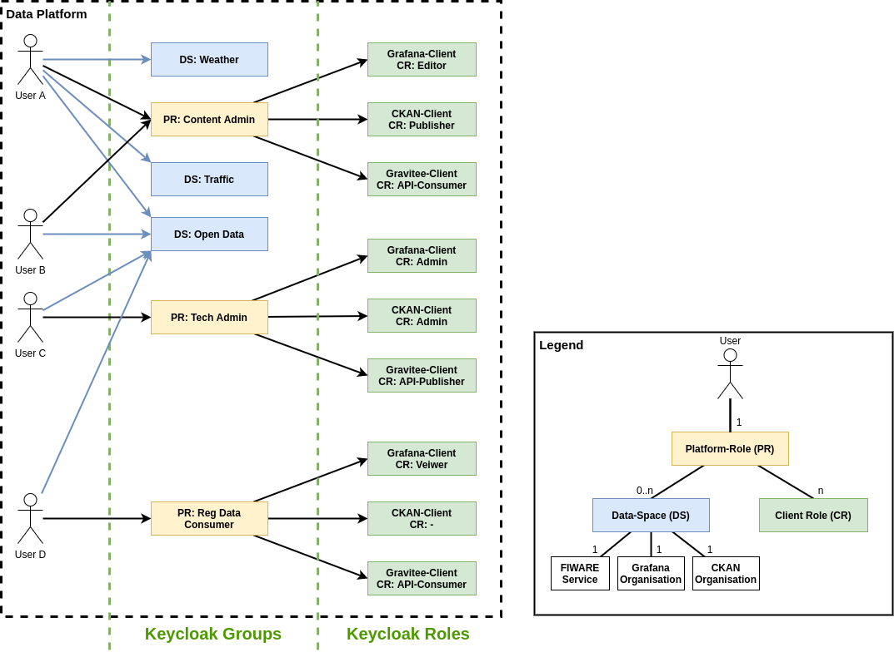

Access Management Concept
================================
This document describes the concept and mechanisms used to restrict specific read, write etc. access to the various components of the platform. It is the basis of the implementation of access controll and a prerequisite for multi-tenancy in the platform.

## Current Status of implementation
The later described Client & Data Space Concept is from technical side inplace after the installation of Keycloak & Gravitee.

For the concrete project the specific clients and groups have to be defined and configured. Additionally the surrounding components have to be configured.

Additionally the Self Registration Changes have to be set and Default Roles have to be configured.

## General Requirements

The concept must be valid for human and technical Users. The main difference will be, that Human User will be consuming the UIs of the Platform. Technical Users will be used for consuming APIs.

## Specific Requirements

Gitlab Issue: https://gitlab.com/berlintxl/futr-hub/project-management/board/-/issues/29

## Clarification
The complete concept targets the Authentication & Autorization für consuming APIs and UIs of the Platform, as they are published as a Service of the Platform. 
Internal Users - e.g. Database Users - are not handled by this concept and maintained with an internal secrets concept.

## OpenIDConnect Feature Overview of existing components
This section describes the capabilities of the components of the platform regarding access control mainly using the OpenIDConnect protocol.
### OIDC Support
The Component supports OpenIDConnect or OAuth2 Integration in a native way. Needed Parameters are Part of the Tools Configuration Options.

### LDAP Support
The Tool supports Authetication based on LDAP.

### Role Evaluation
The Tool can evaluate roles handed over by OIDC or LDAP. Based on this roles a tool specific decision on rights is possible

### Role Mapping
**Tool**: The Tool can map central roles to tool specific roles.
**IDM**: The Tool can only use the given roles, a mapping must be done in IDM

### Group Evaluation
The Tool can evaluate groups handed over by OIDC or LDAP. Based on this groups a tool specific decision on rights is possible

### Group Mapping
**Tool**: The Tool can map central groups to tool specific groups.
**IDM**: The Tool can only use the given groups, a mapping must be done in IDM

### Component Overview

| Component | OIDC Support | LDAP Support | Role Evaluation | Role Mapping | Group Evaluation | Group Mapping |  Remarks |
| -------- | -------- | -------- | -------- | -------- | -------- | -------- | -------- |
| **Gravitee** | YES     | YES | YES     | Tool and IDM | NO     | NO     | YES     | Gravitee can use roles over OIDC and LDAP with same featureset |
| **OAuth2 Proxy** | YES   | NO  | NO     | NO     | YES     | IDM     | If different Clients should be checked, one installation per Client is needed |
| **PGAdmin**     | NO | YES | YES | IDM  | NO     | NO     |  Only LDAP Integration is possible |
| **Grafana**     | YES     | YES     | YES     | YES     | YES     |  YES   | OIDC Support for Roles, LDAP Support for Groups |
| **Masterprotal**     | NO     | NO     | NO     | NO     | NO     |  NO   | Has to be protected by OAuthProxy |
| **QGIS**     | YES     | NO     | NO     | NO     | NO     |  NO   | OWS, WFS, WCS, WMS are compatible, but not supported together with Masterportal |
| **CKAN**     | YES     | YES     | NO     | NO     | YES     |  YES   | Groups are supported over LDAP directly |
| **FROST**     | NO     | NO     | NO     | NO     | NO     |  NO   | Frost http Admin can be protected by OAuth2 Proxy, Frost API over API Management |
| **mosquitto**     | NO     | NO     | NO     | NO     | NO     |  NO   | mosquitto supports authentication only |
| **min.io**     | YES     | YES     | NO     | NO     | YES     |  YES   | Groups are only supported over LDAP |

## Entities in the Authorization

Keycloak supports multiple realms with n clients per realm. The data platform uses only one realm.

Clients are used to seperate security contexts, so that each context (Use Case, Application, ...) can have a specific configuration.

The following clients are defined for the core platform:

1. API Management UI
2. API Access
3. CKAN
4. Geodata (QGIS)
5. Grafana
6. Platform Administration (Nodered, pgAdmin)
7. Masterportal
8. MQTT

## Data Access
The following diagram gives an overview how keycloak concept (yellow boxes) are used to realize access model concepts in components (blue boxes).

In Addition to the directly addressed components, we have specific data spaces (purple boxes), that are controlled by groups in Keycloak. Groups, which are used for data spaces, are flagged in a specific ways, so that a selection of the relevant groups can be executed on login of a user.

Flagged and assigned groups are added to the requested token for the api-access client and these are then evaluated in Gravitee.

Subgroups can differenciate between read, write or delete access. If no Subgroups are used, full access is granted. The subgroups are returned as Scopes in the token and can be directly requested.

Especially for NGSI API the Fiware-Service Header is translated to a group in Keycloak. By assinging the right group the a user, you can grant access to the Fiware-Service.

## Object Access in min.io

The same mechanism can be used to assign rights to special buckets or tenants in min.io. The mapping of groups can be evaluated over LDAP.

## Self registration
Keycloak supports the mechanism of self registration. This process can be enabled on realm level and provides  a self registration option on login pageafter the activation.

A new registered user has no roles or groups assigned in the realm and the clients. To get the user initially in a defined working mode (e.g. as a viewer) we can use client mappers to assign a default role for each client. Additionally we should assign a group to allow access to a demo data space.

More rights must be assigned over roles manuelly by an admin.

## Platform-wide Roles
The defined platform-wide roles (e.g. RegisterredDataConsumer, DataProducer, ContentAdmin or TechAdmin) aggregate application specific Roles in several Applications of the platform. This means in Keycloak, that these several roles are distributed over the corresponding clients.
We use Groups in Kecloak to define platform-wide roles and roles in Keycloak on realm and client level for application-specific roles.

See the following figure for an exemplary mapping.

## Development Environment
For each future use case a new client in keycloak is created. Additionally to the client a new group for the corresponding data space is created.

To avoid installing central software like Grafana many times per use case, we can use Grafana Organizations, to seperate Dashboards and Access to them with integrated functions.

Same seperation can be archived for CKAN using the organizations in CKAN.

## Grafana Integration
The Generic OAuth Plugin for Grafana does not support organizations. But if a self registration in Grafana over OAuth is disabled, then a user can be created before his first login over die Grafana Admin API and then the user will be assigned to the right organization with the right roles.

A detailed description for this can be found [here](https://davidoha.medium.com/how-to-restrict-user-access-with-to-grafana-with-generic-oauth-656a1a660a7b)

## Outlook
The way grafana handles the OAuth Users can be interesting for other Components (like CKAN) too. This has to be checked during the deeper implementation of the Tool Integration.

To start, we will define only one global access (data space) for FROST. This could change in the Future, but no concrete reuqirements are defined for now.