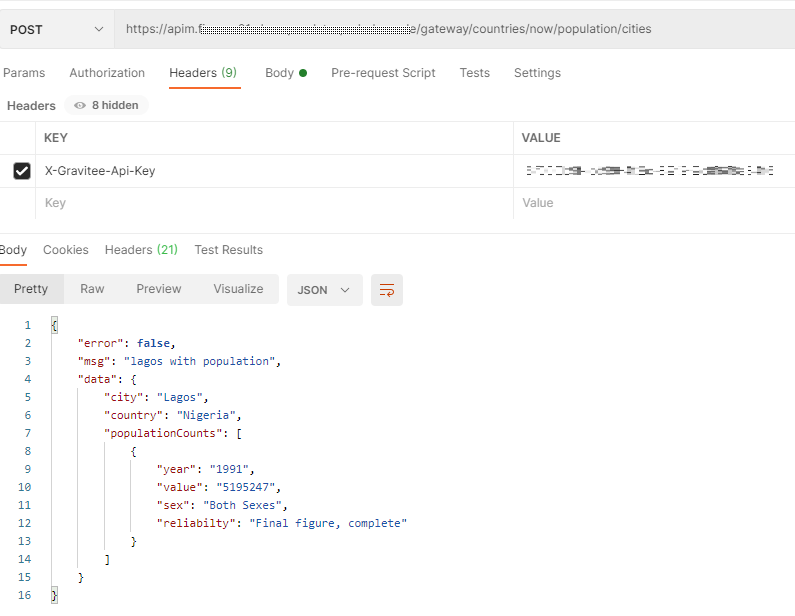

## Add an API

In order to add an api the most convenient way would be to use the the Design-Studio of the API-Management

Navigate to the Management Console https://apim.{STAGE}.{DOMAIN}.de/console/ and log in with the administration account.<br>
Now select `APIs` on the left and hit the `+` button in the lower right.

From the options select the `DESIGN STUDIO` and the first part of the creation form should be presented.<br>
Fill in the form. As an example we use the **countriesnow** API.<br>
When adding the context path, the gateway endpoint has to be included: https://apim.{STAGE}.{DOMAIN}.de/gateway/YOUR_CONTEXT_HERE<br>

<div align="center"></div>

Select `NEXT` to move on to the gateway configuration.

Here the endpoint, the gateway redirects requests towards has to be defined. This can either be a website (make sure you are allowed to integrate the data into your platform), or a component located inside the platform, like it is the case with the context broker.
<div align="center"></div>

Select `NEXT` to move on to the access configuration. <br>

On this page the access model to the API can be configured. In this state of the API the choice is between keyless or API key, where API key is an everlasting string, created when subscribing to the API. It has to be included as a header with the key `X-Gravitee-Api-Key` when requesting the API.
> **Note:** Here it is also possible to choose whether or not, subscribing to the API shall auto-grant access, or if the subscription has to be reviewed and explicitly been granted by the owner/creator of the API.

<div align="center"></div>

> **Note:** If you want to use OAuth, you have got with any plan for now and come back later, because the OAuth resource(see [Clients and Roles](../keycloak/client_roles.md) for more) can only be created afterwards.

Select `NEXT` to move on to the documentation configuration. <br>

If present, it is possible to import a **swagger.json** file in order to have an API documentation listed on the API-Management website. <br>
Select `NEXT` or `SKIP` depending on the existence of a valid documentation.

On the last page now it is possible to either test the API with a generated test key, or to start the API it right away.

<div align="center"></div>

`Start API`  either right away, or test it first.<br>
After the API is started the API's settings page is presented.

<div align="center"></div>

Here two important settings can be found. Publishing and visibility. If you want the API to shown on the API Portal page (https://apim.{STAGE}.{DOMAIN}.de) you need to `Publish the API`. Additionally it is possible to choose whether or not the API shall be visible to everyone or only to group members. By default the API is only visible to group members and one has to `Make it Public` to make it visible to everyone.

Before the API can be tested, a subscription has to be made in order to get an API-key.
>**Note:** This can be skipped if the access plan is set to `keyless`

From the API's settings page, select `Subscribtions` on the left, and hit the `+` button on the lower right.<br>
Simply type the platforms application name and select the application from the list. Select the desired plan from the list below and hit `CREATE`.
<div align="center"></div>

Now the subscription page is displayed, with the API Key showing in the bottom section.

## Test the API

After the API is started and the subscription is done, the API can be tested:

The API used in this example was the countriesnow API. For a test we try to recreate the following, working request:

```shell
curl --location --request POST 'https://countriesnow.space/api/v0.1/countries/population/cities' \
--header 'Content-Type: application/x-www-form-urlencoded' \
--data-urlencode 'city=lagos'
```

Result:
```json
{
    "error": false,
    "msg": "lagos with population",
    "data": {
        "city": "Lagos",
        "country": "Nigeria",
        "populationCounts": [
            {
                "year": "1991",
                "value": "5195247",
                "sex": "Both Sexes",
                "reliabilty": "Final figure, complete"
            }
        ]
    }
}
```

For the url we adjust to the gateway path, configured: https://apim.{STAGE}.{DOMAIN}.de/gateway/YOUR_CONTEXT_HERE<br>
The existing header and data we leave untouched. But adding the `X-Gravitee-Api-Key` header.

```shell
curl --location --request POST 'https://apim.{STAGE}.{DOMAIN}.de/gateway/YOUR_CONTEXT_HERE' \
--header 'X-Gravitee-Api-Key: YOUR_API_KEY_HERE'
--header 'Content-Type: application/x-www-form-urlencoded' \
--data-urlencode 'city=lagos'
```

Here an example for fiware dev, rebuild with postman:
<div align="center"></div>

Copyright © 2021 HYPERTEGRITY AG, omp computer gmbh. This work is licensed under a [CC BY SA 4.0 license](https://creativecommons.org/licenses/by-sa/4.0/).
Author: Thomas Haarhoff, omp computer gmbh