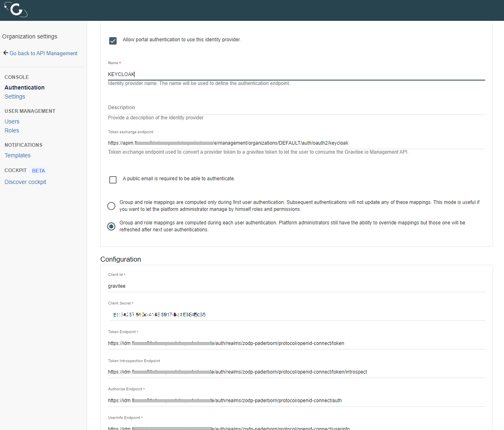

## Identity Provider

Gravitee is capable of managing users by itself, but in this platform we want to have the IDM to authorize access to all applications. On gravitee's end the adjustment is to integrate so-called identity providers.  

This can be done by adding the identity provider to the organization settings within [Gravitee's Administraion Console](https://apim.{DOMAIN}.de/console/#!/organization/settings/identities/)

Additionally during the configuration step the login page https://apim.{STAGE}.{DOMAIN}.de/user/login got its native login mechanism disabled and thus only accepting keycloak as authentication instance in order to login to gravitee.

Copyright © 2021 HYPERTEGRITY AG, omp computer gmbh. This work is licensed under a [CC BY SA 4.0 license](https://creativecommons.org/licenses/by-sa/4.0/).
Author: Thomas Haarhoff, omp computer gmbh