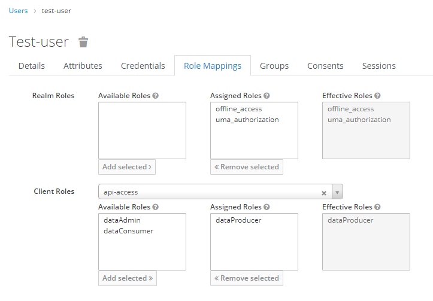

## Add roles to a user

In this guide the [previously created](create_user.md) user will be given the role of a data-producer for the context broker. 

>**Note:** The same procedure is valid for any other client or realm role, you want a user to represent.

Roles can be assigned to a user through the user's settings page. 
First navigate to the user, by selecting `Users` on the left side. 
Afterwards you can either hit the `View all users` button or enter the user-name into the field and press `Enter`. 
From the list presented find the desired user and either click on user-id on the left or the `Edit` button on the right.

From the users settings page, navigate to the `Role Mappings` tab. 
This tab shows two different sections: **Realm Roles** and **Client Roles** 
For this guide we want to add a client role to the user. 
In the Client Role section, select the client `api-access` from the drop down menu. 
From the list of **Available Roles** select the `dataProducer` and hit the `Add selected` button.

Now the user can request access-tokens which include these role and its inherent permissions.

Copyright © 2021 HYPERTEGRITY AG, omp computer gmbh. This work is licensed under a [CC BY SA 4.0 license](https://creativecommons.org/licenses/by-sa/4.0/).  
Author: Thomas Haarhoff, omp computer gmbh