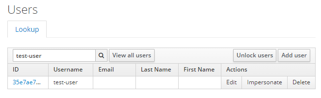
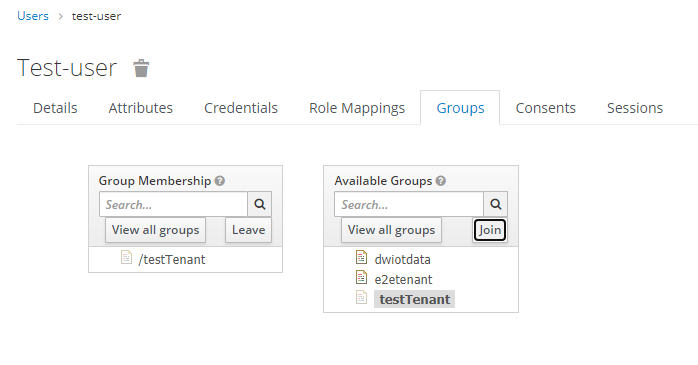

## Add user to a tenant

In this guide the [previously created](create_user.md) user, will be given the access to the [previously created](create_tenant.md) tenant. 

Tenants in this platform are represented by groups with special attributes. 
Therefore, in order to add a user to a tenant, the user needs to joint the group.

>**Note:** The same procedure is valid for any other tenant, you want a user to access.

A user can join a group through the user's settings page. 
First navigate to the user, by selecting `Users` on the left side. 
Afterwards you can either hit the `View all users` button or enter the user-name into the field and press `Enter`. 
From the list presented find the desired user and either click on user-id on the left or the `Edit` button on the right.

From the users settings page, navigate to the `Groups` tab. 
This tab shows two different sections: **Group Membership** which show the current groups of the user and **Available Groups** which swho groups the user may join. 
Select the tenant/group you want the user to join and hit the `Join` button on the right of this section.

>**Note:** The same applies if you want to remove access to the tenant, simply select the desired tenant on the **Group Membership** section and hit the `Leave` button.

Copyright © 2021 HYPERTEGRITY AG, omp computer gmbh. This work is licensed under a [CC BY SA 4.0 license](https://creativecommons.org/licenses/by-sa/4.0/).  
Author: Thomas Haarhoff, omp computer gmbh