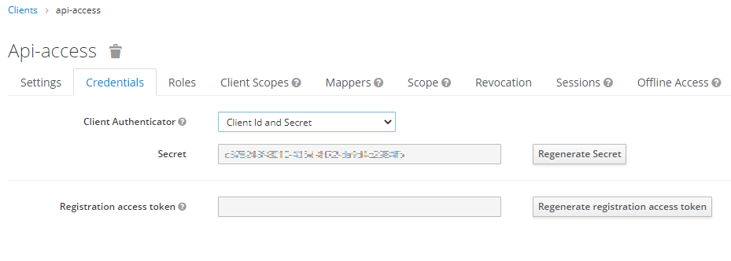
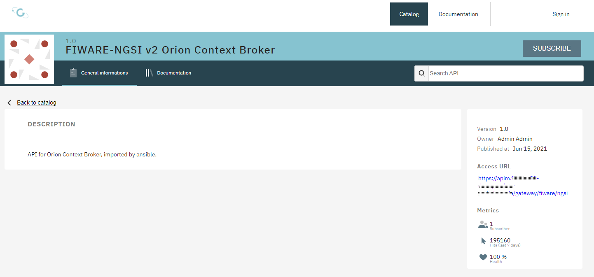
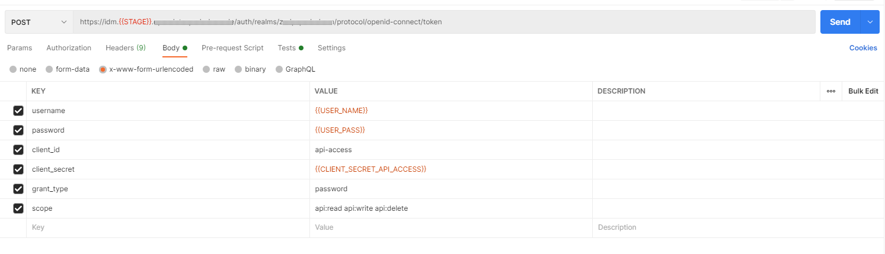
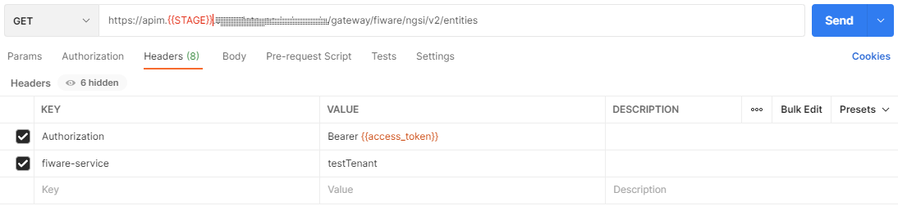

## Access an API

In this guide the [previously created](create_user.md) user will use the API of the IDM and API-Management to use the [previously created](create_tenant.md) tenant with the context broker.

The user is assigned the dataProducer role which translates to permissions of retrieving and contributing data to the context broker using the assigned tenants.


### Preparation
The following values are needed to achieve this:
1. Retrieving an access token
   - IDM token URL
   - User credentials
   - Client id and secret of the client in charge of enforcing API access.
1. Using the access token
   - API base URL path

For this platform the values are the following:<br>
The IDM token URL is https://idm.{STAGE}.{DOMAIN}.de/auth/realms/{YOUR_REALM}/protocol/openid-connect/token <br>
Alternatively you can find this URL within the IDM located at the bottom of the `Realm Settings` menu entry:

Simply click on the link **OpenID Endpoint Configuration** within the realm settings and find the key `token_endpoint` the value of this key is the OIDC token endpoint.

Client id and secret can be found within the credentials tab of the **api-access** client.<br>
Login to the IDM with the Admin user.<br>
Make sure, the correct realm is displayed (not Master) and select `Clients` from the list on the left.<br>
From table of clients select `api-access`.<br>
The client's settings page is presented. Navigate to the `Credentials` Tab.
<div align="center"></div>
> **Note:** The same procedure is valid for every client configured. If you created your own client for a similar purpose. The only requirement is, in the client's settings page the `Access Type` has to be set to `confidential`.

The name of the client (`api-access`) will function as the client_id and the **Secret** is displayed on the page.

For the **API base path** of the context broker you check the API-Management: https://apim.{STAGE}.{DOMAIN}.de/ <br>
From the main page select `Catalog` at the top, or hit the `EXPLORE APIS` button.<br>
On this page select the `All APIs` tab near the top left, or type **fiware** in the `Search API` field in the top right and select the `FIWARE-NGSI v2 Orion Context Broker` from the list.<br>
Now you are presented with the API page of the context broker and on the right side the base path of the API is shown:
https://apim.{STAGE}.{DOMAIN}.de/gateway/fiware/ngsi<br>

<div align="center"></div>

### Retrieving an access token

For this part examples from Postman and cURL will be presented.

For retrieving an access token the form has to be filled like this:<br>
<div align="center"></div>

Same representation using cURL:
```shell
curl --location -g --request POST 'https://idm.{{STAGE}}.{DOMAIN}.de/auth/realms/{YOUR_REALM}/protocol/openid-connect/token' \
--header 'Content-Type: application/x-www-form-urlencoded' \
--data-urlencode 'username={{USER_NAME}}' \
--data-urlencode 'password={{USER_PASS}}' \
--data-urlencode 'client_id=api-access' \
--data-urlencode 'client_secret={{CLIENT_SECRET_API_ACCESS}}' \
--data-urlencode 'grant_type=password' \
--data-urlencode 'scope=api:read api:write api:delete'
```

The result of this request will give you an `access_token`, a `refresh_token` and other informations.

```json
{
    "access_token": "eyJhbGciOiJSUzI1NiIsInR5cCIgOiAiSldUIiwia2lkIiA6ICI1RDVjQndnRkpoNTFsaV9GRVQzcWJvWHAwTTBlWmtEbnViUVZyMmhtS2R3In0.eyJleHAiOjE2MjQwMDA5OTIsImlhdCI6MTYyNDAwMDY5MiwianRpIjoiZWI4Mjg2ZDYtOTMyZi00Yzk2LTllZDAtOTgwODEyZDM3ZWE1IiwiaXNzIjoiaHR0cHM6Ly9pZG0uZml3YXJlLTIxLWRldi5vcGVuZGF0YS1wYWRlcmJvcm4uZGUvYXV0aC9yZWFsbXMvem9kcC1wYWRlcmJvcm4iLCJzdWIiOiIzNWU3YWU3Yy02YzY5LTQyYWMtOWE3MS05N2FhMTk5ZmM5NjgiLCJ0eXAiOiJCZWFyZXIiLCJhenAiOiJhcGktYWNjZXNzIiwic2Vzc2lvbl9zdGF0ZSI6IjUyNmQwMTA5LWNmMWMtNDdiMy1hZWYxLTNlMDg0MzExYTM2OCIsImFjciI6IjEiLCJyZXNvdXJjZV9hY2Nlc3MiOnsiYXBpLWFjY2VzcyI6eyJyb2xlcyI6WyJkYXRhUHJvZHVjZXIiXX19LCJzY29wZSI6ImFwaTpyZWFkIGFwaTp3cml0ZSBlbWFpbCB0ZW5hbnQtbmFtZXMgcHJvZmlsZSB0ZW5hbnRzIiwidGVuYW50cyI6W10sImZpd2FyZS1zZXJ2aWNlcyI6e30sImVtYWlsX3ZlcmlmaWVkIjp0cnVlLCJjbGllbnRfY2hlY2siOiJhcGktYWNjZXNzIiwicHJlZmVycmVkX3VzZXJuYW1lIjoidGVzdC11c2VyIn0.M6ZvOWoBja7X69ng6wb6Cd_t5Fgl42_T1yTHTv7VyUgkQZO9Aqr6kD1_lCr1M6Ir31gPmU_UBzZ0zN3CTSvTVDLx1wFFOF3ShbmpRjQKnZaOdrW0U6sYKjPIs_QHGwJQU6msxKIrVKLWQiZQH6xpD3OEg-bLvPJT67tknrygTkebuzjZtFLsAMcECAVHZwNFojxkhKqpKJWm9CFIhzf9Cw2xZ0y7jfTcifQbkWywWZc4FKjC-BpeW2CYydYriNgYOX8WerpUC3UsIHplZD_fde3m7D6oSXne9oezXKZa3pyEy6aTIgkWcc6tIalBiLrGso2K7nb_7c_FhB8aXCwCMg",
    "expires_in": 300,
    "refresh_expires_in": 1800,
    "refresh_token": "eyJhbGciOiJIUzI1NiIsInR5cCIgOiAiSldUIiwia2lkIiA6ICIyNDgzOGM4Yy00NWQzLTRiODAtYmJhZi1mNDYxNjBmY2YwNDUifQ.eyJleHAiOjE2MjQwMDI0OTIsImlhdCI6MTYyNDAwMDY5MiwianRpIjoiZjI1OTU3NTgtOTEzYy00MmYxLTgzOTEtNTM3YmJmMWYwNTVmIiwiaXNzIjoiaHR0cHM6Ly9pZG0uZml3YXJlLTIxLWRldi5vcGVuZGF0YS1wYWRlcmJvcm4uZGUvYXV0aC9yZWFsbXMvem9kcC1wYWRlcmJvcm4iLCJhdWQiOiJodHRwczovL2lkbS5maXdhcmUtMjEtZGV2Lm9wZW5kYXRhLXBhZGVyYm9ybi5kZS9hdXRoL3JlYWxtcy96b2RwLXBhZGVyYm9ybiIsInN1YiI6IjM1ZTdhZTdjLTZjNjktNDJhYy05YTcxLTk3YWExOTlmYzk2OCIsInR5cCI6IlJlZnJlc2giLCJhenAiOiJhcGktYWNjZXNzIiwic2Vzc2lvbl9zdGF0ZSI6IjUyNmQwMTA5LWNmMWMtNDdiMy1hZWYxLTNlMDg0MzExYTM2OCIsInNjb3BlIjoiYXBpOnJlYWQgYXBpOndyaXRlIGVtYWlsIHRlbmFudC1uYW1lcyBwcm9maWxlIHRlbmFudHMifQ.Augqf6L--VKqSdCTnqm3s_VJUDEpk0sUUM6qQ0vasXY",
    "token_type": "Bearer",
    "not-before-policy": 0,
    "session_state": "526d0109-cf1c-47b3-aef1-3e084311a368",
    "scope": "api:read api:write email tenant-names profile tenants"
}
```

> **Note:** From the request you may see, the requested scopes include `api:delete` in the response only `api:read` and `api:write` are listed. The reason for this is, the user has been assigned the dataProducer role, which is allowed to use the DELETE method on APIs.

> **Note:** The refresh mechanism is already covered in the [migration documentaion](../Migration.md#following-acquiring) in the **Following Acquiring** section.

### Using the access token

For this only simple requests using the `entites` endpoint of the context broker are presented.

When formulating requests towards the context broker, the form needs to be filled like this:
<div align="center"></div>

Same representation using cURL:

```shell
curl --location -g --request GET 'https://apim.{{STAGE}}.{DOMAIN}.de/gateway/fiware/ngsi/v2/entities' \
--header 'Authorization: Bearer {{access_token}}' \
--header 'fiware-service: testTenant'
```

The result of this request will give you a response from the context broker. For the testTenant, there are no data-sets in place, so the result is as expected:
```json
[]
```

If you are using a tenant with data stored in the context broker, you will get the response containing the right-time data of your entities.

### Troubleshooting

This section will present responses, different from the one presented and explain what the meaning of them is and how to solve the problem if applicable.

**1. Session closed**
When using an access token to access an API you may get the following result.
```json
{
    "active": false
}
```
The reason is: the provided access token is not valid anymore.<br>
When requesting an access_token the response shows these values:
```json
{
    ...
    "expires_in": 300,
    "refresh_expires_in": 1800,
    ...
}
```
These values are shown in seconds and tell how long an access_token is valid. The `"active":false` information refers to an expired access token.

**2. Unauthorized, No Content**
In the example above, we tried to access the context broker with a GET method. If we would use the same user, same tenant and try to use the DELETE method, the error would only the status code 401, with no content. This is due to the fact the user is only given the dataProducer role and therefore only able to use the methods `GET`,`PUT`,`PATCH` and `POST` but not `DELETE`.
> **Note:** The same error is presented if the user has no role, or any role, but uses a method the permissions of the role do not match.

The only way to fix this, is either to use a user with enough access rights, or [give the user the desired role](add_user_roles.md) from within the IDM.

**3. Unauthorized, fiware-service**
When accessing the context broker the following result may be presented, alongside the 401 status code.
```json
{
    "message": "{\"error\":\"Missing authorisation for specified fiware-service and fiware-servicePath\",\"code\":\"UNAUTHORISED\"}",
    "http_status_code": 401
}
```

This error is generated at the API-Management and refers to the user not allowed to access the desired fiware service.<br>

Two reasons for this come to mind:
1. The user has not joined the group. [Link to documentation](add_user_to_tenant.md)
1. The group settings miss one or both of the attributes needed. [Link to documentation](create_tenant.md)

Copyright © 2021 HYPERTEGRITY AG, omp computer gmbh. This work is licensed under a [CC BY SA 4.0 license](https://creativecommons.org/licenses/by-sa/4.0/).  
Author: Thomas Haarhoff, omp computer gmbh