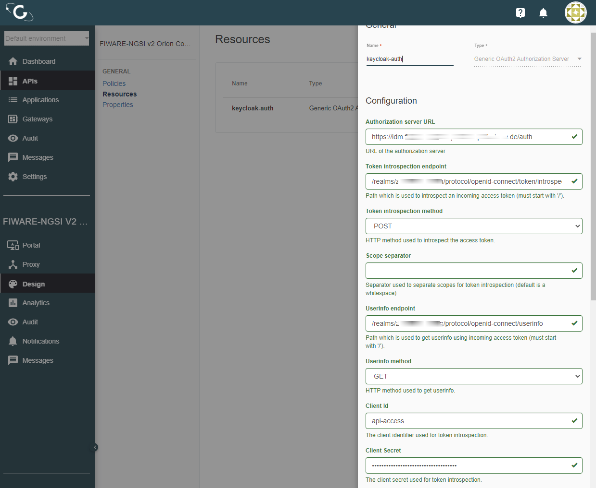
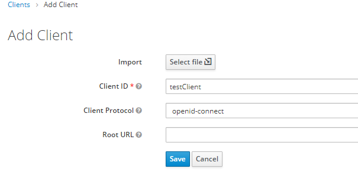
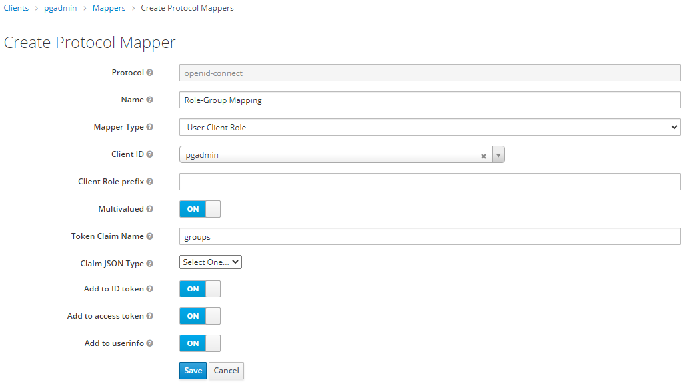

## Clients and Roles

For the initial deployment 8 different clients are configured and provided with roles, which can be used by the individual applications in order to map these OAuth roles to their own application logic.

The preconfigured clients and roles are the following:

| Client | Roles |
| ---    | ---   |
| api-access | dataConsumer dataProducer dataAdmin |
| citywalks | citywalkAdmin |
| ckan | ckanAdmin |
| geodata | geodataAdmin |
| grafana | grafanaAdmin | grafanaEditor | grafanaViewer |
| gravitee | graviteeAdmin |
| nodered | noderedAdmin |
| pgadmin | pgadminAdmin |

The client api-access functions as a authentication client for APIs. 
> Explanation: When adding an API to the API-Management you have to create so-called plans which represents ways access the API. It is possible to combine them, but in general you have the option a plan being `keyless` (no access requirements, open to everyone), `api-key` (a special header with a secret has to be provided when accessing an API), or `token-base`.  In our case the context broker is accessible via a OAuth, a `token-based` plan. Which uses a (in the API-Management) configured OAuth resource, which points the `api-access` client. In general this resource tells API-Management where a give access-token can be sent in order to check its legitimacy.

The following image shows an extract of the API configuration inside the API-Management, of the used resource responsible to handle access-tokens. 

## Adding additional Clients

In order to create a new authority, as a resource to the platform which can be used to login to a distinct client with its own roles and authentication flows, you need to create a new client.

You can achieve this by selecting `Clients` on the left, from within the IDM Administration Console and hitting the `Create` button in the top right. 
In the presented form give your client `Client ID`, set the Client Protocol to `openid-connect` and hit `Save` afterwards. 

Now you are presented the client settings page, which is quite complex. There are 3 changes you need to make.
1. Set the **Access Type** to `confidential`
1. Set **Implicit Flow Enabled** to `ON` and
1. Enter a Valid Redirect URI (or multiple).
> Explanation: The Valid Redirect URI is important because the IDM will only let you log in to the client if you are redirect to the IDM from a URI that matches one of the Redirect URIs on this page. [This image](img/invalid_redirect.PNG) shows the difference(left: correct, right: false).

Hit `Save` at the bottom of the form.
> **Note:** The OAuth credentials `Client ID` and `Client Secret` are now located on the `Credentials` tab (only if **Access Type** is set to `confidential`).
> **Note:** If you want to have a deeper look into the configuration options of the clients, please refer to the Official Documentation on [Managing OIDC Clients](https://www.keycloak.org/docs/latest/server_admin/#oidc-clients) and [Securing Apps](https://www.keycloak.org/docs/latest/securing_apps/).

## Securing Clients with the OAuth2Proxy
Applications which shall be mapped to clients in keycloak in order to give these applications a client-id and client-secret to authenticate against may not have a build-in implementation of the OAuth2 process. 
For these applications it is possible to setup a proxy that will redirect any access back to the IDM login screen, where a user first has to login in order to access the desired application. 
The actual decision IF a user may access the application is done by the OAuth2Proxy. 

> **Note:** The following procedure has to be done due to restrictions of the OAuth2Proxy, because it can not check for accepted roles. The proxy is only able to check whether or a user is in a group or not (but the following procedure will simulate a group for the user which can be checked by the proxy).

Within any client settings page it is possible to setup mappers, which will add informations to the OAuth token issued by any user once a login is performed. This token can be checked by the proxy. 
From the previous section you should still be presented with the client settings page. 
Select the `Mappers` tab at the top and press the `Create`button at  the top right. 
Now give the mapper any name (i.e. Role-Group Mapping) and select `User Client Role` from the drop-down menu next to `Mapper Type` 
The form will change a bit and you are presented with another drop-down menu next to `Client ID`. Select your desired client from the list. 
At last set the field `Token Claim Name` to `groups` and hit `Save`.

If the OAuth2Proxy is configured correctly, accessing the url of the application will present you with the IDM login screen.

## Adding additional Roles

If you ever want to add a role to one of the clients, procedure is the following: 
From within the IDM Administration Console select `Clients` on the left side. 
The list of clients can be filtered by the search bar at the top. Select the your desired client from the list. 
The client's settings tab is displayed. Select the `Roles` Tab.
At the top right hit the button `Add Role`, enter a name for the new role and press `Save`.

Now you can [add the new role to users](add_user_roles.md) of this realm and with the next login the user is given the added role.

Copyright © 2021 HYPERTEGRITY AG, omp computer gmbh. This work is licensed under a [CC BY SA 4.0 license](https://creativecommons.org/licenses/by-sa/4.0/).  
Author: Thomas Haarhoff, omp computer gmbh