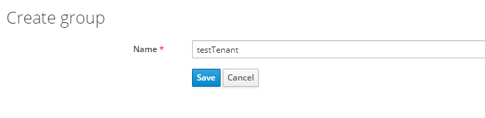
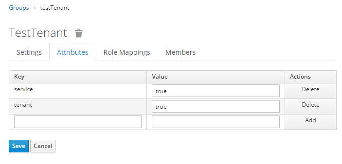

## Add/Create Tenant
Tenants in this platform are represented by groups with special attributes. 
Therefore, in order to create a new tenant, a new group has to be added.

On the left select Groups and hit the button `New` in top right. 
Give it a name and hit `Save`.
Note: The name will be the fiware-service sent to the API-Management via the header.

Afterwards you should be presented with the groups setting page.

## Set Tenant Attributes
In order to use this group as a tenant, 2 attributes have to be added.  
Select the `Attribute Tab. 
Enter the following key-value pairs: 
- Key: service, Value: true. Hit the Add Button on the right.
- Key: tenant, Value: true. Hit the Add Button on the right.
Hit `Save` afterwards.

>__Explanation:__ There are scripts in the client-scopes as token mapper in place, which scan for groups in the IDM with these attributes configured. These groups will then be placed in the OAuth token once a member of these groups requests a login. This token will later be evaluated by the API Management in order to decide whether the user may access a specified fiware-service.

Copyright © 2021 HYPERTEGRITY AG, omp computer gmbh. This work is licensed under a [CC BY SA 4.0 license](https://creativecommons.org/licenses/by-sa/4.0/).  
Author: Thomas Haarhoff, omp computer gmbh