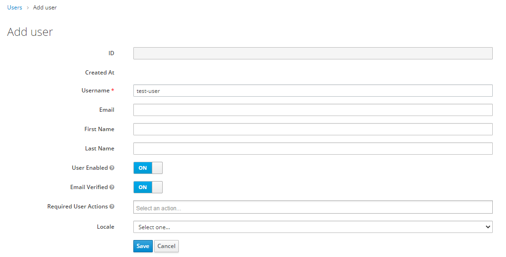

## Add/Create User

On the left select `Users` and hit the button `Add User` in top right.

On this form only the username is mandatory, but a few fields are worth mentioning:

**Email** 
If you choose to give the user an existing Email you enable the option to give the user control the credentials (Reset/Forget Password i.e.)

>__Note:__ As an administrator you can set the Email of an user afterwards at any later time as well.

**Email Verified** 
If you used an existing Email you can leave the switch on `off` and have the user to verify the Email first, before access to the platform is granted. 
Set it to `on` if the user shall be able to do everything right away.

**Required User Actions** 
Leave the `Required User Actions` untouched, since they only specify actions for the next Login through Web-Interface. 
After you filled everything to your needs, hit `Save`.

## Add User Credentials
Now the User is created and only needs a password to use the account. For that select the `Credentials` Tab. 
Option 1: Set the password for the user 
In the **Set Password** section set a password for the user and confirm it. 

>__Note:__ There are password policies in place which have to be followed. See [Password Policy]

Set the switch `Temporary` to `off` and hit `Set Password`. If you want the user to set the password, use option 2. 
>__Note:__ A temporary password will block the user from using the keycloak-api which includes retrieving access-tokens

Option 1: Request the user to set the password. (Only visible if an existing Email is configured for the user) 
In the **Credential Reset** section, select `Update Password` from the list shown when selecting `Reset Actions`. 
>__Note:__ If you set the field `Email Verified` to `off`, you may select `Verify Email` from the List of `Reset Action` press the `Send email` button.

## Check User Console
Each user has access to a self-service GUI which is available for keycloak at `<server-root>/auth/realms/{realm-name}/account` 

Here the user is (e.g.) able to change login credentials or to setup multifactor authentication. 
For more information about this, please refer to the [official documentation](https://wjw465150.gitbooks.io/keycloak-documentation/content/server_admin/topics/account.html).

Copyright © 2021 HYPERTEGRITY AG, omp computer gmbh. This work is licensed under a [CC BY SA 4.0 license](https://creativecommons.org/licenses/by-sa/4.0/).  
Author: Thomas Haarhoff, omp computer gmbh