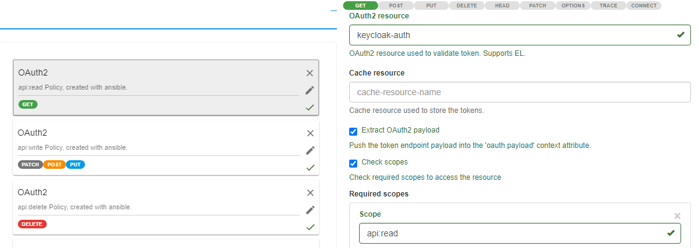
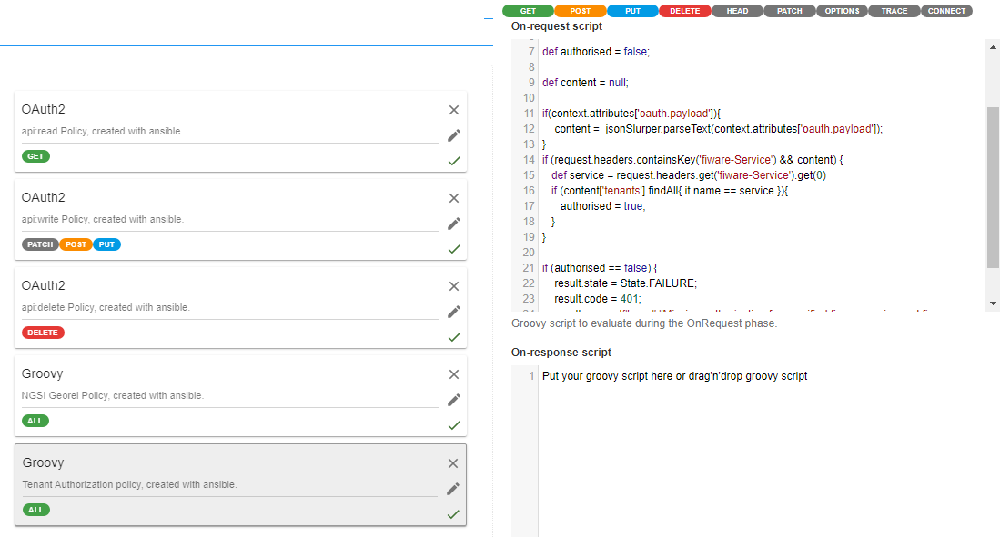
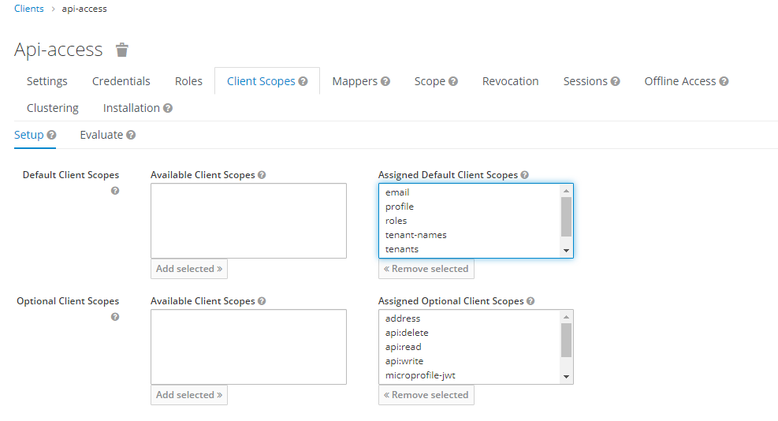

## Client Scopes

For the initial deployment 5 clients scopes are configured and integrated in clients and roles, which are used by the API-Management to decide:
1. Whether or not a user's access-token is allowed to access a specific tenant/fiware-service and
1. Whether or not a user's access-token is allowed to use a given HTTP Method (i.e. GET, POST, DELETE)

These scopes are:
- tenant-names: With this scope enabled, the access token is extended with a plain list of all tenants the user is a member of.
- tenants: With this scope enabled, the access token is extended with the same list as the `tenant`-scope, but also additional informations like the group id are provided
- `api:read`: With this scope enabled, the api-management will allow the HTTP verb `GET`
- `api:write`: With this scope enabled, the api-management will allow the HTTP verbs `PUT`, `POST` and `PATCH`
- `api:delete`: With this scope enabled, the api-management will allow the HTTP verb `DELETE`

When a requests accesses the API-Gateway, it will check at the API-Management if any policies are in place and enforce them. 
For the above described `api:xxx` scopes this is done by strict scope mappings: 

The other scopes are used by another policy, which scans the provided headers for `fiware-service` and tries to map the provided one with the list of allowed tenants located in the access token. 

Other scopes are for example `email`, `phone`or `roles`. These scopes are build-in scopes provided by the base installation of keycloak by default. They are used to enrich the access token with additional information if necessary.

When looking at a client's configuration, you can navigate to the `Client Scopes` Tab and see the enabled scopes for the client. They are divided in **Default** and **Optional** Client scopes. Where default scopes are always included into the access token or login response respectively and optional scopes can be requested by applications or API calls by adding them in the `scope` header. For an example see [the API access example](api_access.md) documentation. 

Copyright © 2021 HYPERTEGRITY AG, omp computer gmbh. This work is licensed under a [CC BY SA 4.0 license](https://creativecommons.org/licenses/by-sa/4.0/).  
Author: Thomas Haarhoff, omp computer gmbh