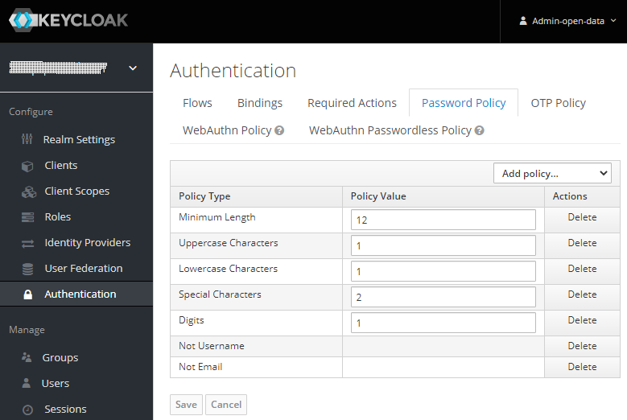

## Password Policy

As part of the automated configuration, keycloak is equipped with a policy regarding the minimum complexity every password has to follow.

To view this policy you need navigate the corresponding realm setting: 
Select `Authenticaion` on the left. 
The general Authentication settings are presented. Navigate to the `Password Policy` tab. 

This represents the policies in place for passwords on this realm. 
These policies assure a reasonable complexity for each user and a complainant with [BSI ORP.4 A22](https://www.bsi.bund.de/SharedDocs/Downloads/DE/BSI/Grundschutz/Kompendium_Einzel_PDFs/02_ORP_Organisation_und_Personal/ORP_4_Identitaets_und_Berechtigungsmanagement_Editon_2020.pdf?__blob=publicationFile&v=1): 

> Regelung zur Passwortqualität [IT-Betrieb] (B) 
> In Abhängigkeit von Einsatzzweck und Schutzbedarf MÜSSEN sichere Passwörter geeigneter Qualität
gewählt werden. Das Passwort MUSS so komplex sein, dass es nicht leicht zu erraten ist. Das Passwort
DARF NICHT zu kompliziert sein, damit der Benutzer in der Lage ist, das Passwort mit vertretbarem
Aufwand regelmäßig zu verwenden.

Copyright © 2021 HYPERTEGRITY AG, omp computer gmbh. This work is licensed under a [CC BY SA 4.0 license](https://creativecommons.org/licenses/by-sa/4.0/).  
Author: Thomas Haarhoff, omp computer gmbh