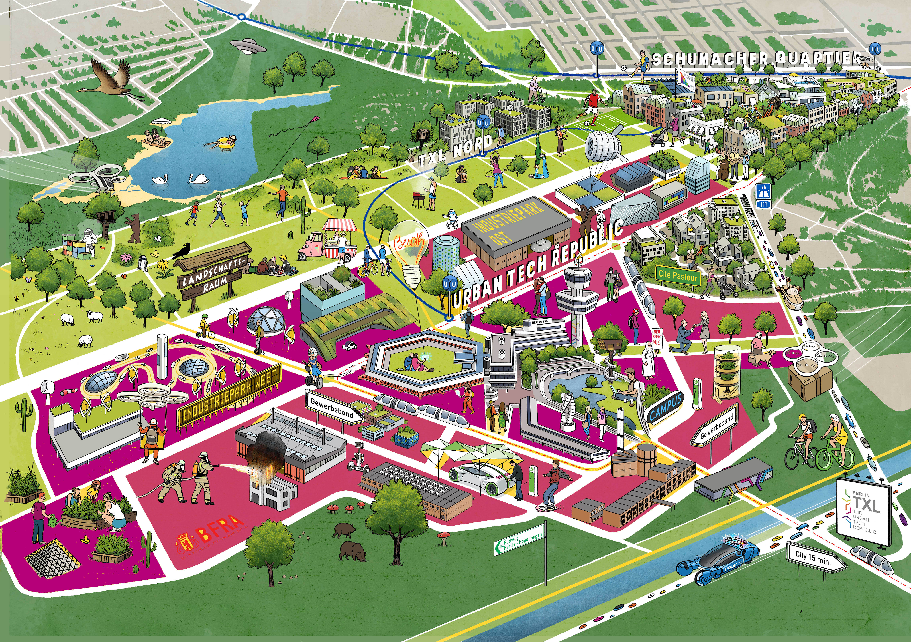

# **We are the Tegel Projekt GmbH**

*Illustration: Tim Dinter*

The former Berlin-Tegel Airport is making room for Berlin. On its 500-hectar grounds, Berlin TXL – the Urban Tech Republic, a research and industrial park for urban technologies, Schumacher Quartier, a new residential district, as well as a 200-hectare landscape zone will be developed.

Berlin State has commissioned Tegel Projekt GmbH with the development and management of Berlin TXL – the Urban Tech Republic, and of Schumacher Quartier. This state-owned company employs 58 people (as of November 2020). Their work includes review of the master plan and brand development, the plans for the building construction, and the technical, utility, and transport infrastructure, as well as sales planning and project communications with the general public.

-> Read more about [Tegel Projekt GmbH](https://www.tegelprojekt.de/en.html)

-> Read more about [The Urban Tech Republic](https://www.berlintxl.de/en.html)

-> Read more about [Schumacher Quartier](https://www.schumacher-quartier.de/)

# **The former Tegel Airport is making room for Berlin to grow.**

The former Tegel Airport is making room for Berlin to grow. Emerging here is an industrial and research park for urban technologies: “Berlin TXL – the Urban Tech Republic”. Berlin is reclaiming a piece of the city and creating spaces for industry, business, and science. And it will be located just 15 minutes from the seat of government of Europe’s most important industrialized nation.

The innovation park aims to keep this 21st century booming metropolis going. This will be the place where urban technologies are researched, developed, produced, tested, and exported. This will be the place where science and research meet industry and businesses, and where start-ups meet investors. And they are all working together on the solutions for the cities of tomorrow.
The curated site will contain six urban tech core themes:

- net-zero energy systems and efficient use of energy
- environmentally friendly transportation
- clean water 
- recycling
- use of new materials for applications such as sustainable construction
- networked control of systems

In the immediate vicinity of the Urban Tech Republic a smart residential district – Schumacher Quartier – will be developed with more than 5,000 homes for more than 10,000 people. And an additional 4,000 homes are being planned in the neighboring districts of Cité Pasteur and TXL Nord.

The total area of Berlin TXL (including districts and landscape park) covers a total surface area of 5 km2 (1,236 acres) -   which is about five percent of the metropolitan area of Paris.

## Timeline implementation

- **Middle of 2021:** Acquisition of the grounds by Tegel Projekt GmbH
- **Beginning fall 2021:** Installation of site logistics, construction roads, elimination of contaminated sites
- **Beginning 2022:** Start of civil engineering works; leases for interim uses in the existing buildings in tandem with restoration and reconstruction; allocation of land
- **Beginning 2027:** Completion of major part of restoration work; accommodation of the Beuth University of Applied Sciences in Terminal A, of the Foundation and Technology Center in Terminal B, and of the Berlin Fire Department and Rescue Services Academy in the hangars
- Development of the overall project in four construction phases up to around 2040

## The project in numbers

**The Urban Tech Republic**
- Project Area Urban Tech Rebublic: 211 ha
- Districts:	
  - Campus: 39 ha
  - Commercial band: 70 ha
  - Industrial Park: 82 ha
  - Main Roads and landscaping: 20 ha

**Berlin TXL Potential**	
- Employees: up to 20,000
- Students:	5,000 (of which 2,500 at Beuth University)
- Companies:	up to 1,000
- Gross value added in Berlin TXL: €1.6 billion p. a. assuming 18,000 jobs
- Gross value added in Berlin TXL: €2.6 billion p.a. (impact on the gross value added in Berlin in total assuming 18,000 jobs in Berlin TXL)
- Tax revenue effect for Land Berlin: €160 million p. a.

# **Berlin TXL – The Urban Tech Republic**

... is an industrial and research park for **urban technologies**. Urban technologies are green technologies of the future that improve people’s lives in the expanding cities all around the world. 

... is a **curated innovation park**. Its core sectors are energy, mobility, water, recycling, and materials, plus information and communication technologies.

... is a site for **research institutions, start-ups** and for **companies both large** and small** around a **university campus.** This will be the place where urban technologies are jointly researched, developed, produced, tested, and exported. 

... offers a space for **all phases of corporate development:** from the pre-seed phase to the development and growth phase, right through to the established enterprise. The range of offerings is correspondingly broad: from the co-working space in the start-up center through office spaces in one of the technology centers, to commercial or industrial properties for corporate investments (commercial and industrial properties from 3,000 to 200,000 m2). Additionally, there are expo and conference halls, testing grounds, overnight accommodations, and food services.

... views itself as a **community** offering advantageous opportunities for collaboration at every corner. The basis is the international brand name “Urban Tech Republic”, which acts like a projection screen to give constant encouragement to the community. 

... is a radiantly powerful ecosystem with meaningful program at its brand core and it has found the perfect site and its natural home in Berlin TXL.

Urban Tech Republic’s program embraces **four basic concepts**, whose specific composition may include, for example, activities, range of offers, or characteristics:

1. The Urban Tech Republic’s brand values are to be found in the “Republic’s Manifesto” and they inform the philosophy of the community and the culture at the site.
2. The Urban Tech Republic offers the community specific, needs-oriented services and products.
3. General places and spaces – for example a university at the core or start-up and technology centers – find their home in the Urban Tech Republic and are an inherent part of the range of offers.
4. The face of the innovation park is shaped by self-starters and ambassadors from the Urban Tech Republic network. These include Tegel Projekt as the operating company for the State of Berlin as well as partners and opinion leaders from the fields of research, economics, industry, and politics.

**Initial anchor tenants:**

- Beuth University of Applied Sciences with 2,500 students in urban technology fields (Central Terminal)
- Berlin Fire and Rescue Service Academy with training operations (hangar)

## The Urban Tech Republic as Smart City and Real-World Laboratory

- [Energy concept:](https://www.berlintxl.de/en/about-berlin-txl/energy-concept.html) A low-energy network, which is unique in the world for its size, supplies Berlin TXL with sustainable heating and cooling. The result is a digitalized marketplace for thermal energy with prosumers who both consume and produce energy.

- [FUTR Hub:](https://www.berlintxl.de/en/about-berlin-txl/futr-hub.html) A networked digital infrastructure will be built in Berlin TXL with the FUTR Hub high-performance IT platform. Urban data will be integrated into the FUTR Hub for smart environmental monitoring, traffic, and energy and rainwater management, as well as intelligent control systems for technical infrastructure, and the processes for facility management at the site will be mapped.

- [Mobility concept:](https://www.berlintxl.de/en/about-berlin-txl/mobility-concept.html) The Urban Tech Republic becomes a compact district and district of short distances with a clearway road for public transport and transportation hubs with options for bike- and car-sharing as well as e-mobility. In addition, the innovation park will be connected to the superordinate network for cycling and public transport.

- Testing grounds: In the Urban Tech Republic, there is room for testing, for instance a test circuit for innovative transportation.

- [Sustainable construction:](https://www.berlintxl.de/en/about-berlin-txl/sustainable-construction.html) In addition to holding certifications for several existing buildings, the Campus in the heart of the innovation park has since 2016 held a Platinum Certificate from the German Sustainable Building Council (DGNB) as the world’s first pre-certified commercial district. Furthermore, with the project Bauhütte 4.0, Wood to City, a new innovation cluster will be constructed with the objective of scaling climate-friendly timber construction to an industrial level, and to achieve significant cost advantages in the medium term over conventional construction. 
- Biodiversity as a planning principle: Animal-Aided Design means that Berlin TXL becomes a habitat and refuge for a wide variety of animal species.

# **FUTR HUB – The center of expertise for urban data**

The intelligent digitalization of cities improves the quality of life, saves resources, and makes urban living and management more sustainable. Berlin TXL is assuming a pioneering role for Germany’s capital as it moves towards becoming a Smart City. To do this, Berlin TXL’s Smart Districts need not only a digital infrastructure, but also places for innovation and a network of partners for the practical and secure use of urban data. The digital infrastructure for Berlin TXL and smart cities worldwide is being developed in the FUTR HUB, the center of expertise for urban data.

## Centerpiece of the FUTR HUB: The platform for urban data

The central infrastructure of the FUTR HUB is a data platform that will collect, link, and present urban data. Urban data can be gathered for instance from sensors in building ventilation systems, traffic lights, and charging stations. On the basis of a geodata infrastructure, as is mentioned in the planning documents for Berlin TXL, the system is brought together with an IoT system step by step and then further developed into a comprehensive data platform around issues such as energy, mobility, and smart nature. All urban data are integrated in terms of perspective by Berlin TXL.

## The FUTR HUB as center of expertise

The data platform is Berlin TXL‘s central technical IT infrastructure. Moreover, it goes without saying that the FUTR HUB will be a comprehensive center of expertise in data solutions. For that reason, it will be absolutely essential to include stakeholders in the FUTR HUB so that entrepreneurs will be able to develop user-oriented value-added services in conjunction with them. With the data platform as the centerpiece, the FUTR HUB comprises five components in all: Development partnership, apps, showroom and lab.
