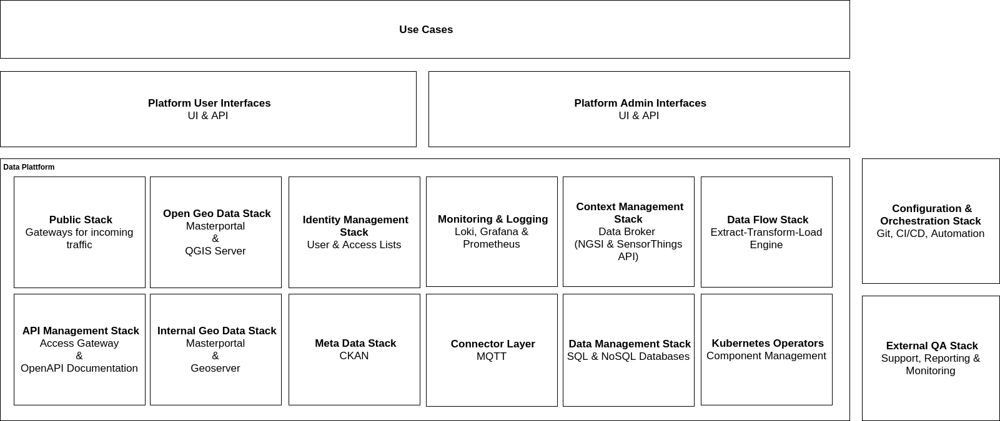

# Welcome to the FUTR HUB Project!

*Illustration: Tim Dinter*

## What it's all About?  
If you want to know about the **FUTR HUB** project or **Berlin Tegel GmbH**, the company behind, please refere to [ABOUT.md](./ABOUT.md).
## Can I Run My Own Copy of FUTR HUB?
If you are interested in how to setup a local copy of this project, read all about in the [Admin Guide](./AdminGuide.md).
## How Do All These Components Work?
You already installed the software stack and want to know, how this software is used? Please read all about it in the [User Guide](./UserGuide.md).
## Can I Participate in This Project?
If you want to be part of the team, read about how to participate in the [Contribution Guide](./CONTRIBUTING.md).
## Project Overview
The project is divided into [platform](https://gitlab.com/berlintxl/futr-hub/platform) and [use-cases](https://gitlab.com/berlintxl/futr-hub/use-cases).

## Architectural Overview
### Kubernetes Platform

## License
This work is licensed under [EU PL 1.2](LICENSE) by the State of Berlin, Germany, represented by [Tegel Projekt GmbH](https://www.tegelprojekt.de/). Please see the [list of authors](AUTHORS-ATTRIBUTION.md) and [list of contributors](LIST-OF-CONTRIBUTORS.md).

All contributions to this repository from January 1st 2020 on are considered to be licensed under the EU PL 1.2 or any later version.
This project doesn't require a CLA (Contributor License Agreement). The copyright belongs to all the individual contributors. For further information, please see the [guidelines for contributing](CONTRIBUTING.md).
